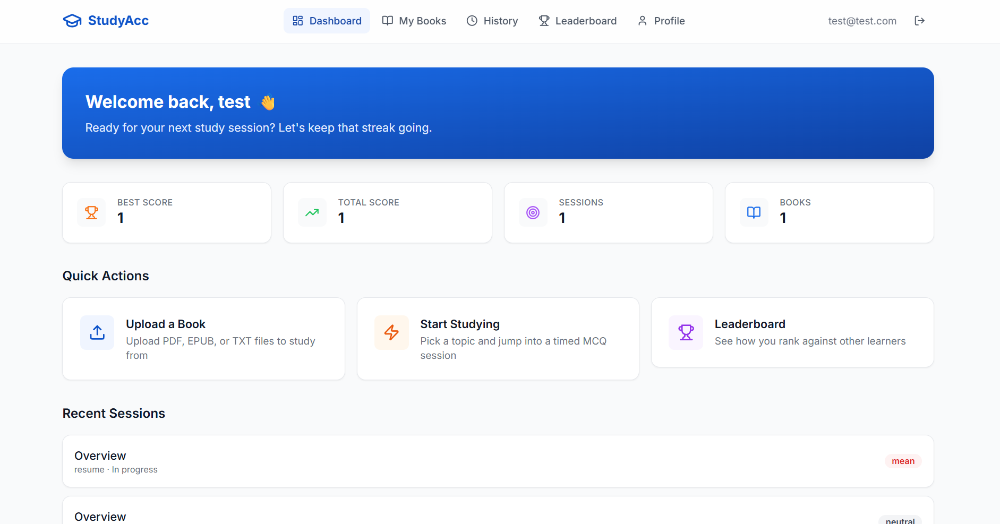
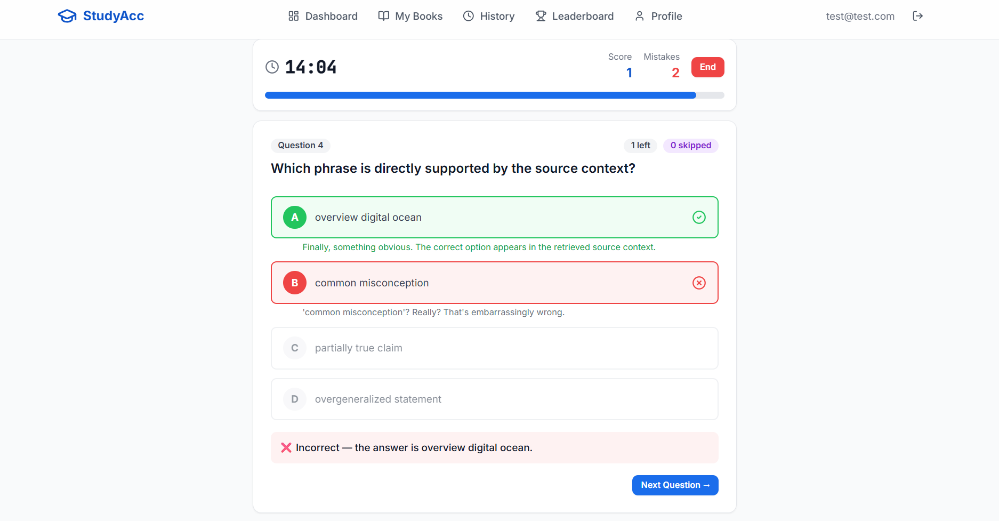
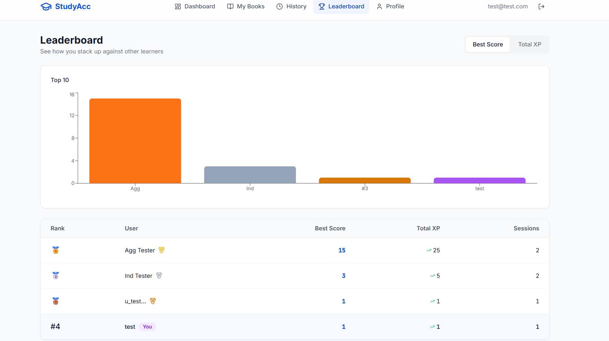
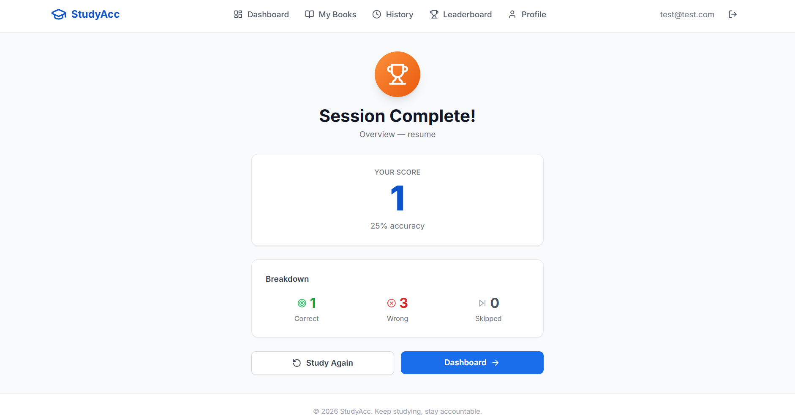

# Accountability Study Platform

A study accountability app that generates MCQ quizzes from your own uploaded material using RAG (Retrieval-Augmented Generation), tracks your performance, and ranks you on a global leaderboard. Optionally roasts you when you get answers wrong.

---

- **Frontend Repository:** [GitHub Link to Frontend Repo](https://github.com/hulkbusterks/Acc_partner_front)
- **Backend Repository:** [GitHub Link to Backend Repo](https://github.com/hulkbusterks/Acc_partner_back)

## What This Project Is

The platform has two halves:

- **Backend** — FastAPI + LangGraph. Handles file ingestion, vector embedding, RAG-based question generation, session lifecycle, scoring, and leaderboard aggregation.
- **Frontend** (this repo) — React SPA. Provides the interface for uploading material, running timed quiz sessions, reviewing per-option reasoning, and viewing leaderboard rankings.

The core loop is straightforward:

1. Upload a PDF, EPUB, or text file.
2. The backend chunks and embeds the content, then extracts topics using RAG or rule-based extraction.
3. Pick a topic, configure a timed session (duration, tone), and start.
4. Answer AI-generated MCQs grounded in your own material. After each answer, you see which option was correct, why it was correct, and why your pick was wrong (if applicable).
5. Session ends when time runs out, all questions are answered, or you end it manually.
6. Score is recorded. Leaderboard updates. Repeat.

"Mean mode" is a toggle that makes the system give you blunt, sarcastic feedback when you answer incorrectly. It is optional and off by default.

---

## Screenshots








---

## Tech Stack

### Backend

| Component | Technology |
|---|---|
| Framework | FastAPI |
| Orchestration | LangGraph v1 |
| Database | SQLAlchemy + Alembic (SQLite default, Postgres ready) |
| Vector store | FAISS (default), pluggable via adapter |
| Embeddings | Hugging Face sentence-transformers (default: all-MiniLM-L6-v2) |
| LLM | Groq adapter (pluggable — mock mode available for local dev) |
| File parsing | PDF, EPUB, plain text |

### Frontend

| Component | Technology |
|---|---|
| Build | Vite 5 |
| Framework | React 18 + TypeScript |
| Routing | React Router v6 (lazy-loaded) |
| Server state | TanStack Query v5 |
| Client state | Zustand (persisted, per-user scoped) |
| HTTP | Axios (JWT interceptors) |
| Styling | Tailwind CSS 3 |
| Animation | Framer Motion |


## User Flow

```
Register / Login
      |
      v
  Dashboard
      |
      v
  Upload Book --> Generate Topics (RAG / Rule)
                        |
                        v
                  Configure Session (topic, duration, tone)
                        |
                        v
                  Active Session
                  - Countdown timer
                  - MCQ with 4 choices
                  - Submit --> see correct answer + reasoning
                  - Skip (tracked separately)
                  - Repeat until done or time expires
                        |
                        v
                  Session Results (score, accuracy, breakdown)
                        |
                        v
                  Leaderboard updated
```

---

## Planned Direction

The current implementation covers the MCQ accountability loop. The next milestone is **AI-guided study sessions**:

- **AI study plan** — the system analyses uploaded material and proposes a timeline with subtopics and estimated durations. The user finalises the plan before starting.
- **Timer-driven study mode** — the user sees only a running clock while studying. At random intervals, a challenge notification appears asking them to answer a question.
- **Adaptive question selection** — questions are chosen based on which subtopic the user should have reached according to the timeline. The user can indicate "I'm not there yet" to re-sync the timeline (with a scoring penalty for being behind schedule).
- **Streak scoring** — consecutive correct answers build a multiplier. Breaking the streak resets it.
- **Pause / resume** — sessions can be paused and resumed; the timer freezes.
- **Configurable frequency** — users set how often challenge notifications appear..

---
